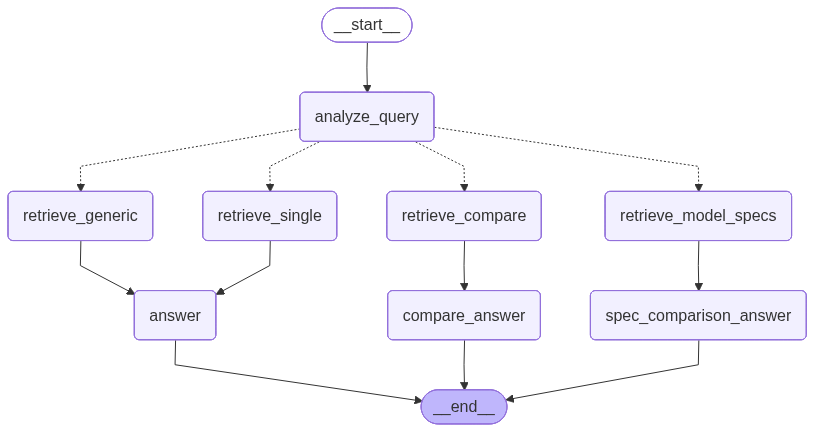

# ME-ECU-Agent
This project is designed to be wrapped in MLflow models.
> **Related Project**: [me-ecu-agent-mlflow](https://github.com/YiZheHong/me-ecu-agent-mlflow) - MLflow-based lifecycle management system built on top of this RAG engine

A Retrieval-Augmented Generation (RAG) system for querying ECU (Electronic Control Unit) technical documentation with intelligent model inheritance and specification comparison capabilities.

## Overview

This project provides an intelligent agent that understands complex queries about ECU models, handles model inheritance relationships, and performs cross-model specification comparisons. It serves as the foundation for [me-ecu-agent-mlflow](https://github.com/YiZheHong/me-ecu-agent-mlflow) - an MLflow-based lifecycle management system.

## Architectural Design

### 1. Chunking Strategy

The system uses a **semantic section-based chunking** approach with automatic specification detection:

**Chunking Pipeline:**

```
Markdown Document
    ↓
[Layer 1] Extract H1 Title
    ↓
[Layer 2] Split by Sections (H2 + Bold Numbered Headings)
    ↓
[Layer 3] Chunk Assembly with Type Detection
    ↓
Final Chunks (with metadata)
```

**Key Design Decisions:**

- **Section-Aware Splitting**: Chunks respect document structure (H2 headers, bold numbered sections)
- **Automatic Type Detection**: Chunks are automatically classified as `spec` (specifications) or `info` (general information) based on section titles
- **Configurable Size with Overlap**: Long sections split with configurable overlap (default: 1500 chars max, 300 chars overlap)
- **Rich Metadata**: Each chunk includes:
  - `source_filename`: Original document
  - `section_title`: Section name
  - `section_path`: Hierarchical path (H1 → H2)
  - `chunk_type`: `spec` or `info`
  - `chunk_index`: Position within section
  - Model metadata: `product_line`, `series`, `covered_models`, etc.

**Why This Approach:**

1. **Preserves Context**: Section boundaries maintain semantic coherence
2. **Enables Targeted Retrieval**: Specification chunks can be retrieved separately for comparison queries
3. **Handles Inheritance**: Metadata tracks model relationships (Plus → Base)
4. **Flexible Configuration**: Chunk size and overlap tunable per use case

### 2. Agent Graph Structure

The system uses **LangGraph** to implement a conditional workflow with 4 distinct query paths:



```
analyze_query (classify intent)
    ↓
    ├─→ retrieve_single        → answer                    → END
    ├─→ retrieve_compare       → compare_answer            → END
    ├─→ retrieve_generic       → answer                    → END
    └─→ retrieve_model_specs   → spec_comparison_answer    → END
```

**Query Types:**

1. **Single Model Query**
   - Example: "What is the max temperature of ECU-750?"
   - Retrieves: Model-specific chunks (with inheritance)
   - Output: Detailed answer about one model

2. **Comparison Query**
   - Example: "Compare ECU-750 vs ECU-850 power consumption"
   - Retrieves: Chunks for each model in parallel
   - Output: Structured comparison

3. **Generic Query**
   - Example: "What is CAN FD?"
   - Retrieves: General knowledge without model constraint
   - Output: Informative answer

4. **Spec Comparison Query**
   - Example: "Which model has the highest operating temperature?"
   - Retrieves: Specification chunks for ALL models
   - Output: Cross-model analysis with ranking

**Design Rationale:**

- **Conditional Routing**: Eliminates unnecessary retrieval steps
- **Parallel Retrieval**: Comparison queries fetch multiple models concurrently
- **Timing Decorators**: Each node measures execution time for optimization
- **Type Safety**: TypedDict state ensures consistent data flow

### 3. Document Selection

**Selection Logic:**

```python
# Query: "What is ECU-850b?"
select_docs_for_model("ECU-850b")
    → Returns:
      - ECU-850b Plus document (explicit coverage)
```

**Why This Matters:**

- **Complete Information**: Plus models inherit base features
- **Accurate Comparisons**: Base features don't get duplicated
- **Transparent Attribution**: Citations show which document provided information

### 4. Retrieval Architecture

**Two-Stage Filtering:**

```
Query → Vectorstore
    ↓
[Stage 1] Doc UID Filtering (model constraint)
    ↓
[Stage 2] Score Thresholding (similarity)
    ↓
Top-K Results
```

**Key Parameters:**

- `retrieval_buffer_k`: Initial retrieval size (default: 50)
- `threshold_score`: L2 distance cutoff (default: 1.0, lower = better)
- `top_k`: Final result count (varies by query type)

**Specialized Retrieval Methods:**

1. **`query_by_model(model, query, top_k)`**
   - Filters by model's doc_uid set
   - Used for single-model and comparison queries

2. **`query_spec_chunks_by_model(model, top_k)`**
   - Filters by `chunk_type='spec'`
   - Used when specifications are needed

3. **`query_all_model_specs(top_k_per_model)`**
   - Retrieves specs for ALL models
   - Used for cross-model comparison queries

**Design Trade-offs:**

- **Buffer Retrieval**: Ensures enough candidates survive filtering
- **No Score Threshold for Specs**: Specs are always relevant when found
- **Deduplication**: Prevents duplicate Base documents in multi-model queries

### 5. Metadata Storage Strategy

**Dual Storage System:**

1. **FAISS Vectorstore** (chunk-level)
   - Embeddings for semantic search
   - Chunk metadata embedded in documents
   - Fast similarity search

2. **SQLite Database** (document-level)
   - DocMeta schema:
     ```sql
     CREATE TABLE doc_meta (
         doc_uid TEXT PRIMARY KEY,
         source_filename TEXT,
         product_line TEXT,
         series TEXT,
         model_type TEXT,
         covered_models TEXT,  -- JSON array
         model_inherits_from TEXT,
         status TEXT           -- 'online' or 'legacy'
     )
     ```
   - Enables efficient model → document lookups
   - Singleton pattern (MetaStore) caches all metadata

**Why Dual Storage:**

- **Separation of Concerns**: Document metadata vs chunk embeddings
- **Query Optimization**: Fast doc_uid filtering before vector search
- **Inheritance Resolution**: Metadata enables model relationship queries

### 6. Configuration Management

**Layered Configuration:**

```
IngestConfig          QueryConfig
     ↓                     ↓
chunk_size            default_top_k
chunk_overlap         threshold_score
embedding_model       retrieval_buffer_k
data_dir              embedding_model
vector_dir            vector_dir
meta_dir              meta_dir
```

**Factory Pattern:**

```python
# From dict
retriever = QueryFactory.from_dict({
    "meta_db_path": "/path/to/doc_meta.sqlite",
    "vectorstore_path": "/path/to/vectorstore",
})

# From config object
config = QueryConfig(...)
retriever = QueryFactory.create(config)
```

**Benefits:**

- **Flexibility**: Tune parameters without code changes
- **Reproducibility**: Configurations are serializable
- **Validation**: Centralized path existence checks

## Project Structure

```
me_ecu_agent/
├── agent/
│   ├── graph.py              # LangGraph workflow definition
│   ├── query_analysis.py     # Intent classification
│   └── agent_retrieval.py    # High-level retrieval wrappers
├── ingest/
│   ├── ingest.py             # Document ingestion pipeline
│   ├── util.py               # Chunking and metadata extraction
│   └── config.py             # IngestConfig
├── query/
│   ├── retriever.py          # Core retrieval logic
│   ├── meta_store.py         # SQLite metadata singleton
│   ├── doc_selector.py       # Model inheritance logic
│   ├── factory.py            # QueryFactory
│   └── config.py             # QueryConfig
├── llm/
│   └── llm_util.py           # Prompt templates and LLM calls
└── data_schema.py            # Shared data structures (DocMeta, QueryIntent)
```

## Key Design Principles

1. **Dependency Injection**: No global state in core classes (Retriever, Graph)
2. **Separation of Concerns**: Clear boundaries between ingestion, retrieval, and agent logic
3. **Type Safety**: TypedDict and dataclasses for all data structures
4. **Configurability**: All parameters externalized to config objects
5. **Observability**: Comprehensive logging at DEBUG/INFO levels
6. **Extensibility**: Factory pattern enables custom configurations

## Quick Start

### Installation

```bash
# Create virtual environment
python -m venv venv
source venv/bin/activate  # On Windows: venv\Scripts\activate

# Install the package
pip install -e .
```

### Basic Usage

```python
python main.py
```

## Use Cases

**Supported Query Patterns:**

- ✅ "What is the operating temperature of ECU-750?"
- ✅ "Compare ECU-750 vs ECU-850 power consumption"
- ✅ "Which model has the highest temperature rating?"
- ✅ "What is CAN FD protocol?"
- ✅ "Show me ECU-850b specifications"
- ✅ "Which ECU is best for harsh environments?"

## Performance Characteristics

- **Ingestion**: ~2-5s per markdown document (depends on size)
- **Query Latency**: 
  - Single model: ~1-2s
  - Comparison: ~2-3s
  - Spec comparison: ~3-5s (queries all models)
- **Memory**: ~500MB for typical vectorstore (10-20 documents)

## Future Enhancements

- [ ] Support for additional document formats (PDF, DOCX)
- [ ] Multi-language documentation support
- [ ] Fine-tuned embeddings for ECU domain
- [ ] Caching layer for frequently asked questions
- [ ] Streaming responses for long-form answers